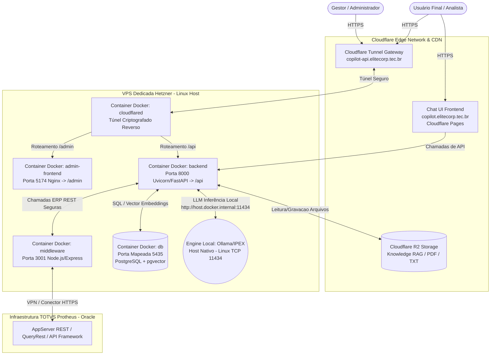

# Memória e Documentação Técnica Completa do Projeto: Copilot Protheus

**Data da última atualização:** 26 de Julho de 2026  
**Versão Arquitetural:** 5.2 (Cloud Multi-Tenant + Governança Granular RBAC)  
**Objetivo do Documento:** Servir como base de conhecimento autoritativa ("System Memory" / Prompt de Contexto) para ferramentas de Inteligência Artificial (Cursor, Cline, GitHub Copilot, Claude, ChatGPT, Google Antigravity) e desenvolvedores de engenharia de software que trabalhem no repositório.

---

## 1. Visão Geral e Propósito do Sistema

O **Copilot Protheus** é um sistema corporativo de Inteligência Artificial, baseado em arquitetura **Multi-Tenant (Multiempresa Centralizada em Cloud)**, concebido especificamente para integrar, analisar dados e expandir as capacidades operacionais e estratégicas do ERP **TOTVS Protheus**.

### 1.1. Pilares Tecnológicos
1. **Zero Alucinação de Dados Empresariais:** É expressamente proibido ao assistente de IA inventar, estimar ou simular valores financeiros, fiscais ou contábeis. Se o ERP não puder ser contatado, ou se a consulta estiver vazia, o erro ou a indisponibilidade devem ser informados com transparência.
2. **Infraestrutura em Nuvem (Hetzner + Cloudflare):** Servidor central hospedado na Hetzner para serviços backend e banco vectorial; Cloudflare Pages e Cloudflare Tunnels para distribuição frontend, CDN e roteamento criptografado sem exposição de portas no firewall.
3. **Suporte Híbrido de Motores LLM:** Capacidade nativa para alternar dinamicamente entre provedores comerciais (Google Gemini 2.5 Flash, OpenAI GPT-4o) e Inteligência Artificial rodando localmente no hardware host (Ollama / IPEX-LLM com aceleração GPU) para garantia de sigilo em consultas ultrassecretas.
4. **Governança Granular de Dados (v5.2):** Controle restritivo por Tenant, Empresa, Ambiente, Papéis (Roles) e Tabelas/Campos do Dicionário Protheus, isolando permissões de leitura (SELECT), filtros (WHERE) e mascaramento (MASK) na raiz do pipeline de IA.

---

## 2. Topologia da Arquitetura (Cloud & Orquestração Docker)



### 2.1. Detalhamento dos Componentes
*   **Interface Principal de Chat (`/frontend`):**  
    * **Tecnologias:** Vite, React, Vanilla CSS / Modern Typography, Lucide Icons.  
    * **Deploy:** Cloudflare Pages (Serverless). Atualiza automaticamente em todo commit efetuado na branch `main` no GitHub via script `npm run build`.  
    * **Domínio Público:** `https://copilot.elitecorp.tec.br`
*   **Painel Administrativo / Protheus Control (`/admin-frontend`):**  
    * **Tecnologias:** Vite, React, Nginx.  
    * **Deploy:** Compilado dentro da VPS Hetzner no contêiner `copilot-protheus-admin-frontend`, servido pelo Nginx na porta interna `5174`.  
    * **Domínio Público:** `https://copilot-api.elitecorp.tec.br/admin`
*   **Backend IA e RAG (`/backend`):**  
    * **Tecnologias:** Python 3.11+, FastAPI, Uvicorn, SQLAlchemy, LangChain, LlamaIndex, OpenAI, Google GenAI, Sentry.  
    * **Deploy:** Contêiner Docker `copilot-protheus-backend`, porta interna `8000`. Responsável pelo orquestramento RAG, geração SQL Oracle por IA, gestão RBAC, autenticação JWT e rotas `/admin/*`, `/agent/*`, `/tenant/*`.  
    * **Domínio Público API:** `https://copilot-api.elitecorp.tec.br/api`
*   **Middleware de Resiliência TOTVS (`/middleware`):**  
    * **Tecnologias:** Node.js, Express, Axios, CORS.  
    * **Deploy:** Contêiner Docker `copilot-protheus-middleware`, porta interna `3001`. Fica isolado dentro da rede interna do Docker (sem exposição pública via tunnel). Atua como proxy de resiliência e formatação para autenticação OAuth/Basic com os serviços REST nativos do ERP Protheus.
*   **Banco de Dados Relacional e Vetorial (`/db`):**  
    * **Tecnologias:** PostgreSQL 16 com extensão nativa `pgvector`.  
    * **Deploy:** Contêiner Docker `copilot-protheus-db` na porta interna `5432` (mapeada externamente na VPS como `5435` para manutenção local ou painel Adminer em porta 8080).

### 2.2. O Guarda-Costas: Cloudflare Tunnel (`cloudflared`)
A VPS Hetzner opera com **Zero Portas Abertas ao Público** em seu firewall para os serviços da web (nem mesmo portas 8000, 5174 ou 3001 estão expostas para a internet aberta). O contêiner `copilot-protheus-cloudflared` cria um túnel reverso de saída (Egress Only) de dentro da Hetzner direto para o Edge Network da Cloudflare. A Cloudflare providencia o TLS/SSL provendo certificado de segurança válido e roteando todo o tráfego recebido no domínio `copilot-api.elitecorp.tec.br` diretamente para os microserviços em Docker.

---

## 3. Diretrizes Comportamentais e Regras de Ouro (Copilot Rules)

Qualquer modelo de inteligência artificial gerando respostas no ecossistema Copilot Protheus deve acatar com rigor absoluto as diretrizes listadas abaixo, sem exceção:

### 3.1. Priorização do SQL Nativo Oracle (TOTVS Cloud)
- **Preferência de Extração:** Sempre que for requisitado relatórios corporativos, demonstrativos financeiros, faturamentos, listagens de estoques ou pedidos, a IA **deve priorizar a formulação e execução de consultas SQL nativas no banco do Protheus**, utilizando o endpoint REST genérico do sistema (`/QueryRest` ou `/api/framework/v1/query`).
- **Paginamento e Limites no Oracle:**
  - O banco de dados alvo no ERP Protheus é **ORACLE**.
  - **PROIBIDA A SINTAXE SQL SERVER/MYSQL:** NUNCA usar cláusulas como `SELECT TOP 50` ou `LIMIT 50`.
  - Para impor um teto em consultas simples: `WHERE ROWNUM <= 500`.
  - Para aplicar paginação moderna no Oracle 12c+: `OFFSET 0 ROWS FETCH NEXT 100 ROWS ONLY`.
- **Formato de Apresentação:** Os resultados devem ser processados e exibidos obrigatoriamente no formato de **tabelas Markdown limpas** e estruturadas, otimizadas para copiar e colar diretamente no Microsoft Excel sem poluição visual.

### 3.2. Proibição Absoluta de Alucinação (Fidelidade aos Dados)
- **Proibido Inventar Valores:** Se uma query SQL retornar conjunto vazio, se uma requisição falhar, ou se a conexão REST com a TOTVS estiver offline ou timeout, **o agente de IA DEVE reportar com precisão técnica o motivo do bloqueio** (ex: *"Não há notas cadastradas nessa filial no período"*, *"A API do cliente retornou erro 500"* ou *"ERP inacessível"*). Em hipótese alguma a IA está autorizada a gerar dados de exemplo ou preencher colunas com estimativas estocásticas.

### 3.3. Modelagem de Consultas no Protheus (Padrões TOTVS / AdvPL)
- **Exclusões Lógicas (Regra 01 do Protheus):** Todo e qualquer comando SELECT executado contra tabelas Protheus **DEVE CONTER** na cláusula `WHERE` o filtro de deleção lógica: `D_E_L_E_T_ <> '*'`.
- **Cruzamentos de Notas Fiscais de Saída (Faturamento):**
  - JOIN obrigatório entre cabeçalho (**SF2**) e itens (**SD2**):  
    `F2_FILIAL = D2_FILIAL AND F2_DOC = D2_DOC AND F2_SERIE = D2_SERIE`.
  - Cruzamento de Operação Fiscal/Financeira (**SF4** / TES): `D2_TES = F4_CODIGO`.
  - Filtro para considerar apenas Notas Normais Faturadas (ignorando devoluções e complementos, se requisitado): `F2_TIPO = 'N'`.
  - Filtro para validar apenas saídas com impacto financeiro no Contas a Receber: `F4_DUPLIC = 'S'`.
- **Cruzamentos de Notas Fiscais de Entrada (Compras/Recebimento):**
  - JOIN obrigatório entre **SF1** (cabeçalho) e **SD1** (itens):  
    `F1_FILIAL = D1_FILIAL AND F1_DOC = D1_DOC AND F1_SERIE = D1_SERIE AND F1_FORNECE = D1_FORNECE AND F1_LOJA = D1_LOJA`.
  - Cruzamento de TES: `D1_TES = F4_CODIGO`. Filtro usual para entradas normais: `F1_TIPO = 'N'`.
- **Desenvolvimento AdvPL no ERP:**  
  - Variáveis `Local` em códigos AdvPL DEVEM obrigatoriamente ser declaradas nas linhas iniciais do escopo da função ou método. É **inadmissível** programar variáveis locais dentro de laços ou condições (`If`, `For`, `While`) ou após processamentos iniciais na rotina.

### 3.4. Diretrizes de Desenvolvimento de APIs REST TOTVS
- **Proibição do `WSRECEIVE` com JSON Body:** Em rotinas advpl `WSMETHOD POST`, `PUT` e `PATCH` que recebam o payload via formato JSON em seu corpo HTTP, **nunca assine** o método utilizando a palavra reservada `WSRECEIVE`. A cláusula `WSRECEIVE` força o Framework REST da TOTVS a desviar o parse para variáveis na URL/QueryString, invalidando ou esvaziando a chamada de leitura `::GetContent()`. Reserve `WSRECEIVE` exclusivamente para chamadas `GET` ou `DELETE`.
- **Documentação Swagger / Rotas:** Defina imperativamente as cláusulas `DESCRIPTION` e `WSSYNTAX "/rota"` em toda declaração de classe `WSRESTFUL` e métodos vinculados.
- **Tratamento de Exceções HTTP:** Utilize o padrão nativo do framework REST `SetRestFault(nStatusCode, cMensagem)` em falhas (gerando a saída padronizada `{"errorCode": ..., "errorMessage": ...}`). Para repostas bem-sucedidas em string JSON: `::SetResponse(cJsonData)`.

---

## 4. Arquitetura v5.2 — Catálogo Multi-Tenant, Snapshot e Governança (RBAC)

A **versão 5.2** introduz uma camada profunda de governança de dados ao backend, protegendo contra exfiltração de dados sensíveis ou acesso a campos proibidos (ex: comissões, salários ou custos sigilosos) por perfis de usuário não autorizados.

### 4.1. Tabelas SQL da Governança e Dicionário (PostgreSQL)
Todas as chaves estrangeiras (`tenant_id`, `company_id`, `environment_id`) são modeladas como **`VARCHAR(100)`** para acomodar sem quebras tanto códigos alfanuméricos (ex: `'rodol_mg'`, `'cliente_alpha'`, `'default'`) quanto UUIDs padrão da plataforma:

| Tabela | Função / Propósito Principal |
| :--- | :--- |
| **`tenant_dictionary_sources`** | Controla os agendamentos, cron jobs, carimbos de data/hora e metadados das sincronizações de dicionário contra cada cliente/tenant do Protheus. |
| **`dictionary_tables`** | Resumo snapshot das tabelas do SX2010 do cliente (chave: `table_name`, descrição, módulo e quantidade estimada de registros). |
| **`dictionary_fields`** | Campos individuais mapeados do SX3010 (`field_name`, `table_name`, título do campo, tipo de dado `X3_TIPO`, precisão decimal, máscara de visualização e regras de validação/contexto). |
| **`dictionary_indexes`** | Índices físicos da tabela no ERP (mapeados a partir do SX1/SIX) para permitir à IA estruturar JOINs e pesquisas impulsionados por índices de alta perfomance. |
| **`dictionary_groups`** | Grupos de dados (SXG) utilizados em máscaras e padronizações de largura para campos de mesmo contexto funcional. |
| **`tenant_table_permissions`** | Conceder ou bloquear em nível de Role (papéis de usuário, ex: 'Vendas', 'Financeiro') a habilidade de consultar a tabela de nível primário (`can_select`, `can_insert`). |
| **`tenant_field_permissions`** | Bloqueio atômico de segurança. Define por campo se a role pode ler (`can_select = false` esconde o campo do Prompt do LLM) e qual o modo de exibição (`field_mode`: `'full'`, `'hidden'`, `'masked'`, `'anonymized'`). |

### 4.2. Resolução de Configurações ERP do Tenant (`protheus_service.py`)
Para garantir estabilidade ao realizar chamadas às APIs REST do Protheus para clientes em qualquer estágio de cadastro, a função `get_tenant_config(tenant_id: str)` opera em sistema de prioridades em **5 camadas**:
1. **`Connector` + `Environment`:** Procura conectores ativos na tabela `connectors` vinculados ao tenant.
2. **`TenantConnector`:** Varre a tabela da fase de governança por tenant (`tenant_connectors`).
3. **`Tenant` (Tabela de Clientes Raiz):** Caso não haja conector isolado em tabela própria, faz a verificação na própria linha de cadastro do Cliente (colunas `protheus_rest_url`, `protheus_user` e `encrypted_protheus_password`).
4. **`Company` (Tabela de Empresas):** Consulta o cadastro da Empresa subordinada em busca da coluna de conexão `protheus_rest_url`.
5. **Fallback Global (`.env`):** Caso o cliente requisitado seja o ambiente `"default"`, `"admin"` ou de homologação local, reverte suavemente para as credenciais definidas em variáveis de ambiente globais `PROTHEUS_REST_URL`.

*Nota:* O módulo de criptografia (`security.py -> decrypt_password`) possui blindagem de resiliência: caso tente ler do banco uma senha armazenada temporariamente em texto claro sem enfileirar erro `InvalidToken` da biblioteca Fernet, processará a autenticação em modo tolerante e evitará travamentos ou erros 500 no Uvicorn.

---

## 5. Estrutura de Diretórios e Componentes (Code Map)

```
c:\projeto\copilotprotheus\
 ├── .agents/                    # Regras automáticas do Agente IA (AGENTS.md)
 ├── .git/                       # Repositório de controle de versão
 ├── admin-frontend/             # Projeto React/Vite - Painel de Controle de Admin e Governança
 │   ├── src/                    # Telas (Tenants, Conectores, Snapshot v5.2, Monitor Hetzner)
 │   └── package.json
 ├── backend/                    # Core Engine (API FastAPI, LangChain, RAG, Gerador SQL)
 │   ├── app/
 │   │   ├── api/                # Controladores de Rotas REST (admin_routes.py, catalog_v52_routes.py, tenant_routes.py)
 │   │   ├── core/               # Módulos vitais: Segurança JWT/Fernet, Autenticação, Configurações de .env e Logs
 │   │   ├── db/                 # Banco: Sessionmaker SQLAlchemy, Migrations DDL Automáticas e Base Engine
 │   │   ├── models/             # ORM: Tabelas knowledge.py (Tenants/Companies), catalog_v52.py (RBAC/Dicionários)
 │   │   ├── schemas/            # Pydantic Schemas de validação para input e output REST
 │   │   └── services/           # Lógica de Negócio: protheus_service.py (HTTP/REST ERP), sync_dictionary_v52.py (Jobs Snapshot), catalog_service_v52.py (Governança e Permissão por Role)
 │   ├── scripts/                # Scripts auxiliares SQL e Shell (ex: 001_catalog_snapshot_permissions.sql)
 │   ├── Dockerfile
 │   └── requirements.txt        # Dependências Python (FastAPI, SQLAlchemy, Uvicorn, psycopg2-binary, Langchain, etc.)
 ├── db/                         # Configurações do serviço Postgres, schemas iniciais e Dockerfile para pgvector
 ├── docs/                       # Documentações manuais, referências da TOTVS e artefatos em PDF/HTML
 ├── frontend/                   # Interface Externa / Chatbot Final Hospedada na Cloudflare Pages (Vite/React)
 ├── middleware/                 # Node.js Express Server: Rota intermediária e blindagem externa contra o TOTVS AppServer
 ├── docker-compose.yml          # Manifesto orquestrador central Hetzner (Backend + DB + Tunnel + Admin)
 └── PROJECT_MEMORY.md           # Este documento: A referência técnica imutável e autoritativa de projeto
```

---

## 6. Configurações e Variáveis de Ambiente (`backend/.env`)

| Variável | Descrição / Exemplo de Configuração |
| :--- | :--- |
| `LLM_BACKEND` | Define a engine ativa de LLM da plataforma: `gemini`, `openai` ou `ollama`. |
| `GEMINI_API_KEY` | Chave de autenticação no Google AI Studio (Modelos 2.5 Flash / Pro). |
| `GEMINI_MODEL` | Identificador do modelo do Google. Ex: `gemini-2.5-flash`. |
| `OLLAMA_BASE_URL` | Rota para acesso ao LLM hospedado no host Linux fora do Docker: `http://host.docker.internal:11434`. |
| `OLLAMA_MODEL` | Nome da LLM local na Hetzner (ex: `gemma3:1b`, `llama3:8b`). |
| `DATABASE_URL` | String completa PostgreSQL com usuário: `postgresql://postgres:password_here@db:5432/copilot_protheus`. |
| `DB_DRIVER` | Dialeto para montagem de comandos analíticos: `oracle`. |
| `JWT_SECRET` | Chave secreta de criptografia para tokens administrativos e do Fernet (AES-128/256). |
| `R2_ENDPOINT_URL` | URL de chamada AWS S3-compatible da Cloudflare R2 Storage (RAG Base). |
| `R2_ACCESS_KEY_ID` | Identificador da Chave AWS S3 para leitura/gravação de artefatos RAG. |
| `R2_SECRET_ACCESS_KEY`| Chave Secreta para manipulação no Bucket de Conhecimento R2. |
| `R2_BUCKET_NAME` | Nome do Bucket de RAG (ex: `copilot-knowledge`). |
| `HETZNER_API_TOKEN` | Token administrativo da Hetzner Cloud para leitura de métricas de CPU/RAM/Disco no Admin. |

---

## 7. Guia Operacional e Deploys na Hetzner (Comandos SSH)

Sempre que modificações estruturais ou corretivas forem comitadas na branch `main`, o processo de implantação em produção na **Hetzner** segue os passos precisos abaixo:

### 7.1. Atualização e Reconstrução (Deploy Padrão)
Se o código no backend, painel administrativo ou middleware for atualizado, o comando `docker compose restart` por si só **NÃO BASTA**, pois o contêiner subirá a imagem antiga inalterada. É obrigatório solicitar ao Docker que recompile a camada da imagem:

```bash
# 1. Conectar via SSH ao Servidor Hetzner
cd /root/copilotprotheus

# 2. Puxar as novidades do Git (Branch main)
git pull origin main

# 3. Rebuildar o microserviço afetado sem derrubar o restante (ex: backend)
docker compose up -d --build backend

# Caso seja atualização geral na estrutura completa (Backend + Admin UI)
docker compose up -d --build
```

### 7.2. Troubleshooting Comum
- **Erro 502 Bad Gateway no Cloudflare / Admin:** Ocorre se o serviço do Uvicorn não conseguir dar boot (geralmente provocado por erro de importação Python ou falha de conexão à porta de banco de dados).  
  *Diagnóstico:* Rodar no console SSH o comando para ver os logs do Uvicorn e localizar a pilha da exceção (Traceback):
  ```bash
  docker compose logs -n 50 -f backend
  ```
- **Sincronização de Banco de Dados / Tabelas Novas (v5.2):** O arquivo de entrada do backend (`app/main.py`) possui rotina idempotente no arranque do servidor. As tabelas da v5.2, chaves e colunas são testadas via SQL `CREATE TABLE IF NOT EXISTS` automaticamente toda vez que o contêiner `backend` sobe. Não há necessidade de rodar scripts de migração na mão via psql na maioria das atualizações.
- **Checar o Status do Agente Local IA (Ollama):**  
  Por rodar no Linux Host (para utilizar recursos brutos e drivers aceleração sem as limitações do isolamento em contêiner Docker), os comandos são disparados na raiz SSH da Hetzner:
  ```bash
  systemctl status ollama
  ollama ps
  ollama list
  ```
